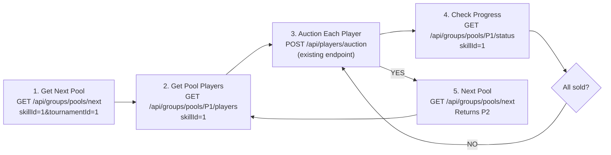

# Implementation Summary: Pool-Based Auction System

## What Was Implemented

A complete **pool-based auction system** that allows organizing players into multiple independent pools per skill category. The system uses the existing `groupCode` field as pool identifier (P1, P2, P3, etc.) without any database schema changes.

---

## Files Created

### 1. **AuctionPoolService.java** (New)
- **Location:** `src/main/java/com/cricket/auction/service/AuctionPoolService.java`
- **Purpose:** Core service managing pool-level operations
- **Methods:**
  - `getPoolsBySkill()` - Get all pools for a skill with status
  - `getNextActivePool()` - Get first incomplete pool
  - `getPoolPlayers()` - Get players in specific pool
  - `getNextPoolPlayers()` - Get players from next pool
  - `getPoolStatus()` - Get detailed pool statistics
  - `isPoolComplete()` - Check if pool is fully auctioned

### 2. **PoolStatus.java** (New)
- **Location:** `src/main/java/com/cricket/auction/model/PoolStatus.java`
- **Purpose:** DTO for pool status information
- **Fields:** skillId, skillName, poolCode, total, sold, remaining, isComplete

---

## Files Modified

### 1. **PlayerRepository.java** (Enhanced)
- **Location:** `src/main/java/com/cricket/auction/repository/PlayerRepository.java`
- **Changes Added:** 5 new query methods
  ```java
  getPoolsBySkill(Integer skillId, Integer tournamentId)
  getPoolPlayers(Integer skillId, String poolCode)
  getPoolCompleteCount(Integer skillId, String poolCode)
  getPoolTotalCount(Integer skillId, String poolCode)
  getNextPoolForSkill(Integer skillId, Integer tournamentId)
  ```
- **Why:** Enable pool-level queries without schema changes

### 2. **GroupController.java** (Enhanced)
- **Location:** `src/main/java/com/cricket/auction/controller/GroupController.java`
- **Changes Added:** 6 new REST endpoints
  ```
  GET /api/groups/pools - Get all pools for skill
  GET /api/groups/pools/next - Get next active pool
  GET /api/groups/pools/{poolCode}/players - Get pool players
  GET /api/groups/pools/next/players - Get next pool players
  GET /api/groups/pools/{poolCode}/status - Get pool status
  GET /api/groups/pools/{poolCode}/complete - Check pool complete
  ```
- **Backward Compatibility:** Old `/api/groups` endpoint unchanged

### 3. **AuctionController.java** (Enhanced)
- **Location:** `src/main/java/com/cricket/auction/controller/AuctionController.java`
- **Changes Added:** 1 new endpoint
  ```
  GET /api/auction/next-pool-players - Get next pool players
  ```
- **Note:** Existing `/api/players/auction` POST endpoint unchanged

---

## Data Model (No Changes!)

### Existing Fields Used
```java
// In Player entity
private Integer skillId;      // Skill category (1=Batsman, 2=Bowler)
private String groupCode;     // Pool identifier (P1, P2, P3)
private Status playerStatus;  // SOLD, UNSOLD, NOT_ASSIGNED
```

### Pool Structure Example
```
Batsman (skillId=1)
├── Pool P1: Players 1,2,3,4,5
├── Pool P2: Players 6,7,8,9,10
└── Pool P3: Players 11,12,13,14,15

Bowler (skillId=2)
├── Pool P1: Players 16,17,18,19
└── Pool P2: Players 20,21,22,23,24
```

---

## How It Works

### Pool Completion Logic
A pool is **COMPLETE** when:
```
Total players in pool = (SOLD count + UNSOLD count)
AND remaining count = 0
```

### Auto-Progression
When you call `GET /api/groups/pools/next`:
1. System fetches all pools for skill in order (P1, P2, P3...)
2. For each pool, checks: `total - (SOLD + UNSOLD) = remaining`
3. Returns **first pool with remaining > 0**
4. If all pools complete, returns pool with `isComplete=true`

### Player Status Flow (Per Pool)
```
Step 1: Player in pool → Status: NOT_ASSIGNED
Step 2: Auctioned → Status: SOLD or UNSOLD
Step 3: All players status changed → Pool COMPLETE
Step 4: Next pool available → Call get next pool API
```

---

## Auction Workflow Example



---

## API Endpoints Summary

| Endpoint | Method | Purpose | Query Params |
|----------|--------|---------|--------------|
| `/api/groups` | GET | Get legacy groups | - |
| `/api/groups/pools` | GET | All pools for skill | skillId, tournamentId |
| `/api/groups/pools/next` | GET | Next active pool | skillId, tournamentId |
| `/api/groups/pools/{poolCode}/players` | GET | Pool players | skillId |
| `/api/groups/pools/next/players` | GET | Next pool players | skillId, tournamentId |
| `/api/groups/pools/{poolCode}/status` | GET | Pool status | skillId |
| `/api/groups/pools/{poolCode}/complete` | GET | Is pool complete | skillId |
| `/api/players/auction` | POST | Auction player | (body) |
| `/api/auction/next-pool-players` | GET | Next pool players (alt) | skillId, tournamentId |

---

## Backward Compatibility ✅

### Existing Endpoints (UNCHANGED)
```
GET /api/players               → Still works
POST /api/players/auction      → Still works
GET /api/teams                 → Still works
GET /api/groups                → Still works
```

### Existing Business Logic (UNAFFECTED)
- Player auction status updates work as before
- Team purse deduction works as before
- TeamPlayer records still created correctly
- No database migrations needed

### Backward Path
If you don't use pool endpoints:
```java
// Old way still works
List<PlayerResponse> allPlayers = playerService.getPlayersInfo();
// Auction without pool awareness
auctionService.updatePlayerStatus(playerId, teamId, price, status);
```

---

## Configuration Required

**No new configuration needed!** System automatically:
- Detects pools from `groupCode` values
- Groups players by skillId + groupCode
- Tracks status via existing `playerStatus` field

**Data Preparation (if starting fresh):**
1. Ensure players have `groupCode` set (P1, P2, P3, etc.)
2. Ensure players have `skillId` set correctly
3. Set `isConsiderInAuction = 0` for pool players
4. Set `playerStatus = 'NOT_ASSIGNED'` initially

---

## Testing Recommendations

### Unit Tests to Create
```java
// Test pool retrieval
testGetPoolsBySkill_ReturnsPoolsInOrder()
testGetPoolsBySkill_ReturnsEmptyForNoData()

// Test pool progression
testGetNextActivePool_ReturnsFirstIncompletePool()
testGetNextActivePool_SkipsCompletePool()
testGetNextActivePool_ReturnsNullWhenAllComplete()

// Test player filtering
testGetPoolPlayers_ReturnsOnlyNotAssignedPlayers()
testGetPoolPlayers_FiltersBySkillAndPool()

// Test completion detection
testIsPoolComplete_ReturnsTrueWhenAllSoldOrUnsold()
testIsPoolComplete_ReturnsFalseWhenRemaining()
```

### Integration Tests
```java
// Test end-to-end auction flow
testCompletePoolAuctionFlow() {
    // 1. Get next pool
    // 2. Auction all players
    // 3. Verify pool marked complete
    // 4. Next pool becomes active
}

// Test parallel skills don't interfere
testMultiSkillPoolsIndependent() {
    // Skill1 auction doesn't affect Skill2
}
```

### Manual Testing (Postman/Curl)
```bash
# 1. Get pools
curl "http://localhost:8080/api/groups/pools?skillId=1&tournamentId=1"

# 2. Get next pool
curl "http://localhost:8080/api/groups/pools/next?skillId=1&tournamentId=1"

# 3. Get players
curl "http://localhost:8080/api/groups/pools/P1/players?skillId=1"

# 4. Auction player
curl -X POST "http://localhost:8080/api/players/auction" \
  -H "Content-Type: application/json" \
  -d '{"playerId":1,"teamId":2,"soldPrice":150000,"status":"SOLD"}'

# 5. Check progress
curl "http://localhost:8080/api/groups/pools/P1/status?skillId=1"

# 6. Check if complete
curl "http://localhost:8080/api/groups/pools/P1/complete?skillId=1"
```

---

## Known Limitations & Future Enhancements

### Current Limitations
- Pool order is alphabetical (P1, P2, P3, P10, P11...)
  - To fix: Use numeric extraction `ORDER BY CAST(SUBSTRING(groupCode, 2) AS INT)`
- No pool-specific settings (max bids, time limits, etc.)
  - Future: Create `tblAuctionPool` table if needed

### Potential Enhancements
1. Pool-level configuration (min/max price limits per pool)
2. Pool-specific auction rules
3. Timed auctions per pool
4. Reverse pools (descending order)
5. Pool templates for recurring tournaments

---

## Summary of Changes

```
Files Created:           2
├── AuctionPoolService.java
└── PoolStatus.java

Files Modified:          3
├── PlayerRepository.java (+5 queries)
├── GroupController.java (+6 endpoints)
└── AuctionController.java (+1 endpoint)

Database Changes:        NONE ✅
Breaking Changes:        NONE ✅
Backward Compatible:     YES ✅
```

---

## Next Steps

1. **Run the build** to verify no compilation errors
2. **Start the application** and test endpoints via Swagger UI
3. **Populate test data** with groupCode values (P1, P2, etc.)
4. **Test endpoints** following manual testing section above
5. **Integrate with frontend** using provided API documentation

---

## Documentation Files

- **POOL_AUCTION_IMPLEMENTATION.md** - Detailed technical documentation
- **POOL_API_QUICK_REFERENCE.md** - Quick reference guide for APIs
- **POOL_SYSTEM_CHANGES.txt** - This summary

---

## Support

For any issues:
1. Check logs for SQL errors
2. Verify groupCode and skillId are set correctly
3. Ensure playerStatus values are valid
4. Review pool completion logic in AuctionPoolService
5. Check database queries in PlayerRepository
